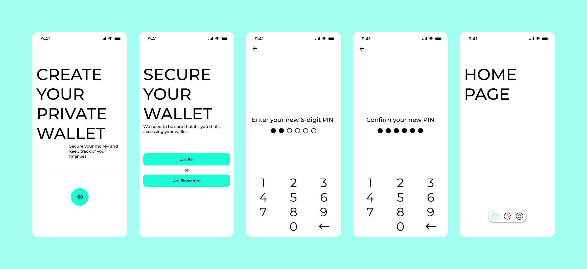

# Walenje

Walenje is a kotlin multiplatform project, built with Compose multiplatform, Coroutines, Koin and Material 3 based on MVI presentation with clean architecture
<br>
<br>
Walenje is Swahili/Sheng' for *wallet*


## Open-source libraries
- [Kotlin](https://kotlinlang.org/) based, [Coroutines](https://github.com/Kotlin/kotlinx.coroutines) + [Flow](https://kotlin.github.io/kotlinx.coroutines/kotlinx-coroutines-core/kotlinx.coroutines.flow/) for asynchronous.
- [Kotlin Serialization](https://github.com/Kotlin/kotlinx.serialization): Kotlin multiplatform / multi-format serialization.
- [Compose multiplatform](https://github.com/JetBrains/compose-multiplatform): a modern UI framework for Kotlin.
- [Compose navigation](https://www.jetbrains.com/help/kotlin-multiplatform-dev/compose-navigation-routing.html): for navigation.
- [Ktor](https://github.com/ktorio/ktor): for making network requests.
- [Koin](https://github.com/InsertKoinIO/koin): a pragmatic lightweight dependency injection framework.
- Architecture
  - MVI Architecture
  - Clean Architecture
- [Material 3](https://m3.material.io/components): Material 3 components.

## Screenshots
### Android


### IOS

### Desktop

## Original design

Adapted from [Walenje App design]() by [Some Designer]().


# License
```xml
Copyright 2023 M0Coding (Mohamed Ben Rejeb)

Licensed under the Apache License, Version 2.0 (the "License");
you may not use this file except in compliance with the License.
You may obtain a copy of the License at

   http://www.apache.org/licenses/LICENSE-2.0

Unless required by applicable law or agreed to in writing, software
distributed under the License is distributed on an "AS IS" BASIS,
WITHOUT WARRANTIES OR CONDITIONS OF ANY KIND, either express or implied.
See the License for the specific language governing permissions and
limitations under the License.
```